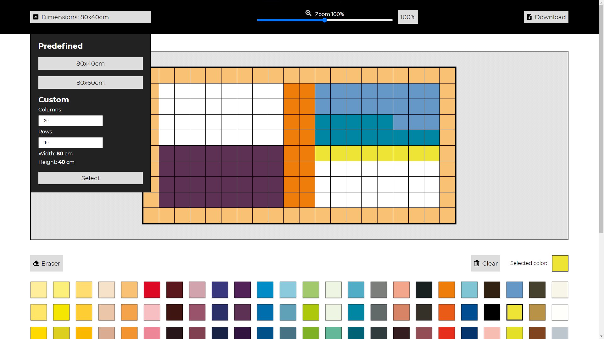

# Forest Diemensions Creator


## Table of contents
* [General info](#general-info)
* [Technologies](#technologies)
* [Setup](#setup)
* [Live](#live)

## General info
Creator for company Forest Dimension. It is used for design wooden paintings.
	
## Technologies
Project is created with:
* HTML
* CSS
* JavaScript

## Setup
To run this project, install it locally using npm:

```
$ npm install
$ npm run build
```

## Live
You can see it live at [kubafila.github.io/forest-dimension-creator](https://kubafila.github.io/forest-dimension-creator/).
